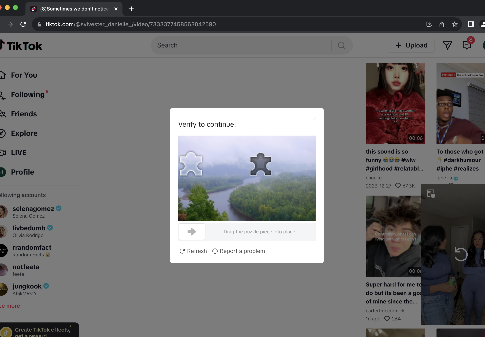

# CS315-Project-2

Explanation of TikTok Scraper Code saved in ```TikTokScraper.py```

This time, I tried to use seleniumbase's api more. <br>
Since we just want to scrape video info, we only have to manually log in once at the start of the code. I tried using guest mode to login, but it won't let me see the comment section so we'll have to log in ourselves. 

```TikTokScraper.py``` info:
- unlike proj1 where we had to interact with the For You page, this time we are just scraping video info. 
- Thus I used Seleniumbase's ```get_beautiful_soup()``` function to scrape the whole page and save it.
- run the Testing file:
```
pytest TikTokScraper.py --html="report_test.html"
```
-  when you run this code, a new folder is made with the current time as the name. 
- Each vido page is scraped and saved in this ```current_time``` folder as ```vid_index.html```, where the index is the index of the video in the ```video_list```. ex) vid_2.html is the 2nd video in the video list

Great, now we have ```.html``` files with all the information, now we just have to extract the parts we want!

After we scrape each video page and save it into each num.html file, we want to extract info out of the files now.  <br>
We start with something simple: given one video html page, extract:
1.  num of likes, shares, saves,comments, plays(new!) (in video box)
2.  username, nickname, description, music  (below video box)
3.  first batch of comments

We will do this using ```BeautifulSoup```


```python
from bs4 import BeautifulSoup as BS
import pandas as pd
```


```python
with open('./02-28-01-04-38/vid_0.html', 'r') as f:
    contents = f.read()

    soup = BS(contents, "html.parser")
    url = soup.find("meta", property="og:url")['content']
    username = soup.find("span", {"class": "css-1c7urt-SpanUniqueId evv7pft1"}).text
    nickname = soup.find("span", {"class": "css-1xccqfx-SpanNickName e17fzhrb1"}).text
    description = soup.find("span", {"class": "css-j2a19r-SpanText efbd9f0"}).text
    music = soup.find("div", {"class": "css-pvx3oa-DivMusicText epjbyn3"}).text
```


```python
print("url:",url,"\nusername:", username,"\nnickname:", nickname, "\ndescription:", description,"\nmusic:",music)
```

    url: https://www.tiktok.com/@pinkydollreal/video/7311845651862637829 
    username: pinkydollreal 
    nickname: Pinkydoll 
    description: NPC in the mall with  
    music: GTA San Andreas Theme - HYGH Lofi Music & Lobit & Cooky


```python
comment_div = soup.find_all("p", {"class": "css-xm2h10-PCommentText e1g2efjf6"})
comments = []
for comment in comment_div:
    comments.append(comment.text)
print(comments)
```

    ['Imagine seeing pinky doll in the mall 😱', 'the fact this is laval', 'THEY NEED HER IN GTA 6-', 'I SAW THEM😭', 'Carrefour Laval spotted', 'iceeeee cream soooo goooddd', 'the random back flip 😭😭', 'He did a whole back flip lol', 'oh noooo not in public right toooo', '😭 she’s in laval?', 'This is a w collab', 'What is laval 🤔', 'Who came from Alibaba video', 'UMM CARREFOUR HOW DID I MISS THIS', 'I came here from the santa juju walk rizz vid', 'BYE NOT CARREFOUR', '@ₘᵢₗₑₙₐ 🤍 not this too', '@kiki🔛🔝 PINKY DOLL AT CF', '@breakinMcqueen95 @💗현진 아내💗 @Estriper literally at cf laval', 'Slay', '@Jaya⸆⸉ it’s so preppy in here!', 'YES YES YES', '@Gabriella🩷 at c4 agaib😔', 'I swear I love me some pinkydoll 🫶🫶', '@The best y/n BAHAHAHA', 'Is that car four Laval ?', 'like how Kris Kross did dat back flip', 'OMG YHU SAW ALIBABA I KNEW HE SAW YHU ON HIS VIDEO 😭😭', "😳 I'm a pray for you sis", 'I was like yassss girl walk that walk', '😭 this was more npc then an npc is', 'Roblox 🙂', 'the flip was dope 😅', 'I sweater I have seen him on snapchat shorts', 'HES SO FRICKEN TINY', 'I love it!', '@𝓗’ HEKP C CAREFOUR', 'Snapped', 'how are malls still in business?', 'You are so amazing']


```python
import re
import json
script_tag = soup.find('script', text=re.compile('stats'))
script_content = script_tag.string 
data = json.loads(script_content)["__DEFAULT_SCOPE__"]['webapp.video-detail']['itemInfo']['itemStruct']["stats"] #json to python dict, and keep looking
like_count = data['diggCount']
share_count = data['shareCount']
comment_count = data['commentCount']
playCount = data['playCount']
collectCount = data['collectCount']
print("\nlike:",like_count, "\nshare:",share_count, "\ncomment:", comment_count, "\nplay:", playCount, "\ncollect:", collectCount)
```

    
    like: 45500 
    share: 1205 
    comment: 744 
    play: 732700 
    collect: 2911


    /var/folders/6y/w5dznchj3w9cyjt81v33hf1c0000gn/T/ipykernel_5366/1639323669.py:3: DeprecationWarning: The 'text' argument to find()-type methods is deprecated. Use 'string' instead.
      script_tag = soup.find('script', text=re.compile('stats'))


Now we **generalize** this code to loop through all the ```.html``` files. We do this in  ```parse_html.py```

<h3>Troubleshooting <br> </h3>
known issues: <br>
1. close popup on bottom right
3. Even though we are logged in, TikTok **asks you to solve Captcha to proceed randomly**, so pay attention to the console message!


