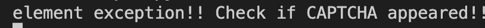
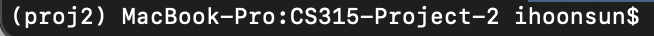

# CS315-Project-2
Please read the troubleshooting section for conda environment setup.
#### Things to fix/consider:
- video_url.csv from user json file too big: ex) 34414 videos -> batch? randomly pick?
- one video link takes 8 seconds to scrape
- for test run, captch appeared around video 3 & 70 out of 100 videos
- if you see "element exception!! Check if CAPTCHA appeared!!" on console, you have 15 seconds to go to the chrome page and solve the captcha.

### How to Run, Input, Output
#### Input, Output
Our input is each ```{video_url}.csv```, a .csv file of video urls that we want to extract information from <br>. In pre-processing folder.
Our output will be ```videos_info.csv```, a .csv file with the extracted information. <br>
These files are in this repo, from the test runs. ```videos_info.csv``` for the test I ran on 03/24 for url file 14110 is in the ```14110-03-04-11``` folder<br>

#### How to Run
1.
```
pytest -s TikTokScraper.py --html="report_test.html" --data="video_urls_14110.csv" #replace the csv file with the one you want to extract information from
```
2.
```
python parse_html.py "14110-03-04-11 #replace "14110-03-04-11" with your folder(date) created from 1.
```


### Code/Folder Explanation

#### ```TikTokScraper.py```

Since we just want to scrape video info this time, we only have to manually log in once at the start of the code. I tried using guest mode to login, but it won't let me see the comment section so we'll have to log in ourselves. 

```TikTokScraper.py``` info:
- unlike proj1 where we had to interact with the For You page, we just scrape video info.
- Thus we use Seleniumbase's ```get_beautiful_soup()``` function to scrape the whole page and save it.
- run the Testing file:
```
pytest -s TikTokScraper.py --html="report_test.html"
```
-  when you run this code, a new folder is made with the current time as the name. 
- Each video page is scraped and saved in this ```current_time``` folder as ```vid_index.html```, where the index is the index of the video in the ```video_list```. ex) vid_2.html is the 2nd video in the video list

Great, now we have ```.html``` files with all the information, now we just have to extract the parts we want. This code is in  ```parse_html.py```
####  ```parse_html.py```
we extract:
1.  num of likes, shares, saves,comments, plays(new!) (in video box)
2.  username, nickname, description, music  (below video box)
3.  first batch of comments

### Troubleshooting <br>
known issues: <br>
1. close popup on bottom right
2. Even though we are logged in, TikTok **asks you to solve Captcha to proceed randomly**, so pay attention to the console message!


3. Setting up the environment:
Assumes you already have conda installed.
The conda environment used is in ```environment.yaml```
Navigate into the cloned folder (this one).
```
conda env create -f environment.yaml 
```
```
conda activate proj2
```
Now you should see something like this:



### Detailed Code Explanation: 
This section is from ```ScraperTutorial.ipynb``` in this repo, which is a simplified version of ```parse_html.py```

After we scrape each video page and save it into each num.html file, we want to extract info out of the files now.  <br>
We start with something simple: given ***one video html page***, extract:
1.  num of likes, shares, saves,comments, plays
2.  username, nickname, description, music
3.  first batch of comments

We will do this using ```BeautifulSoup```


```python
from bs4 import BeautifulSoup as BS
import pandas as pd
```


```python
with open('./14110-03-04-11/vid_0.html', 'r') as f:
    contents = f.read()

    soup = BS(contents, "html.parser")
    url = soup.find("meta", property="og:url")['content']
    username = soup.find("span", {"class": "css-1c7urt-SpanUniqueId evv7pft1"}).text
    nickname = soup.find("span", {"class": "css-1xccqfx-SpanNickName e17fzhrb1"}).text
    description = soup.find("span", {"class": "css-j2a19r-SpanText efbd9f0"}).text
    music = soup.find("div", {"class": "css-pvx3oa-DivMusicText epjbyn3"}).text
```


```python
print("url:",url,"\nusername:", username,"\nnickname:", nickname, "\ndescription:", description,"\nmusic:",music)
```
    #OUTPUT
    url: https://www.tiktok.com/@pinkydollreal/video/7311845651862637829 
    username: pinkydollreal 
    nickname: Pinkydoll 
    description: NPC in the mall with  
    music: GTA San Andreas Theme - HYGH Lofi Music & Lobit & Cooky


```python
comment_div = soup.find_all("p", {"class": "css-xm2h10-PCommentText e1g2efjf6"})
comments = []
for comment in comment_div:
    comments.append(comment.text)
print(comments)
```
    #OUTPUT
    ['Imagine seeing pinky doll in the mall 😱', 'the fact this is laval', 'THEY NEED HER IN GTA 6-', 'I SAW THEM😭', 'Carrefour Laval spotted', 'iceeeee cream soooo goooddd', 'the random back flip 😭😭', 'He did a whole back flip lol', 'oh noooo not in public right toooo', '😭 she’s in laval?', 'This is a w collab', 'What is laval 🤔', 'Who came from Alibaba video', 'UMM CARREFOUR HOW DID I MISS THIS', 'I came here from the santa juju walk rizz vid', 'BYE NOT CARREFOUR', '@ₘᵢₗₑₙₐ 🤍 not this too', '@kiki🔛🔝 PINKY DOLL AT CF', '@breakinMcqueen95 @💗현진 아내💗 @Estriper literally at cf laval', 'Slay', '@Jaya⸆⸉ it’s so preppy in here!', 'YES YES YES', '@Gabriella🩷 at c4 agaib😔', 'I swear I love me some pinkydoll 🫶🫶', '@The best y/n BAHAHAHA', 'Is that car four Laval ?', 'like how Kris Kross did dat back flip', 'OMG YHU SAW ALIBABA I KNEW HE SAW YHU ON HIS VIDEO 😭😭', "😳 I'm a pray for you sis", 'I was like yassss girl walk that walk', '😭 this was more npc then an npc is', 'Roblox 🙂', 'the flip was dope 😅', 'I sweater I have seen him on snapchat shorts', 'HES SO FRICKEN TINY', 'I love it!', '@𝓗’ HEKP C CAREFOUR', 'Snapped', 'how are malls still in business?', 'You are so amazing']


```python
import re
import json
script_tag = soup.find('script', text=re.compile('stats'))
script_content = script_tag.string 
data = json.loads(script_content)["__DEFAULT_SCOPE__"]['webapp.video-detail']['itemInfo']['itemStruct']["stats"] #json to python dict, and keep looking
like_count = data['diggCount']
share_count = data['shareCount']
comment_count = data['commentCount']
playCount = data['playCount']
collectCount = data['collectCount']
print("\nlike:",like_count, "\nshare:",share_count, "\ncomment:", comment_count, "\nplay:", playCount, "\ncollect:", collectCount)
```

    #OUTPUT
    like: 45500 
    share: 1205 
    comment: 744 
    play: 732700 
    collect: 2911


Now we **generalize** this code to loop through all the ```.html``` files. We do this in  ```parse_html.py```

If you have any questions/found new errors, ask Johanna :)
